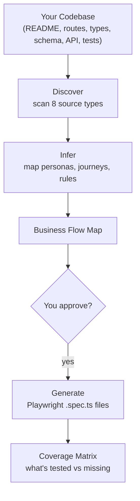

<p align="center">
  <h1 align="center">e2e-architect</h1>
  <p align="center">
    <strong>Stop testing buttons. Start testing your business.</strong>
  </p>
  <p align="center">
    A Claude Code skill that understands your SaaS product first,<br/>then generates E2E tests that actually matter.
  </p>
  <p align="center">
    <a href="#install">Install</a> &middot;
    <a href="#quick-start">Quick Start</a> &middot;
    <a href="#how-it-works">How It Works</a> &middot;
    <a href="#modes">Modes</a> &middot;
    <a href="#test-philosophy">Philosophy</a>
  </p>
</p>

---

## The Problem

You asked an AI to write E2E tests. It gave you this:

```typescript
test('should render the submit button', async ({ page }) => {
  await page.goto('/dashboard');
  await expect(page.getByRole('button', { name: 'Save' })).toBeVisible();
});
```

Congratulations. You now know the button exists. You still don't know if your product works.

**Every existing E2E test generator works at the UI level.** They see buttons, forms, and links. They emit tests that assert those elements exist. The result: hundreds of shallow tests that pass even when your product is completely broken.

## The Solution

**e2e-architect** doesn't look at the DOM. It reads your codebase to understand what your product *does* — then writes tests that verify it actually does it.

```typescript
test('creator can publish content and external audience can access it', async ({ browser }) => {
  // Persona A: create and publish
  const creatorPage = await creatorContext.newPage();
  await creatorPage.goto('/new');
  await creatorPage.getByLabel('Title').fill('Getting Started Guide');
  await creatorPage.getByRole('button', { name: /add section/i }).click();
  await creatorPage.getByLabel('Body').fill('Welcome to the platform...');
  await creatorPage.getByRole('button', { name: /publish/i }).click();

  // Persona B: verify the content is actually accessible
  const readerPage = await browser.newContext().then(c => c.newPage());
  await readerPage.goto('/public/getting-started-guide');
  await expect(readerPage.getByText('Welcome to the platform')).toBeVisible();
});
```

The difference? This test validates a **business outcome** across two personas. If the publish button renders but the API silently fails, this test catches it. The old test doesn't.

## How It Works



The skill scans **8 source types** to understand your product:

| Source | What It Reveals |
|---|---|
| Requirements / PRDs | Product intent, acceptance criteria |
| README / CLAUDE.md | Product elevator pitch, architecture |
| Route definitions | Every screen a user can visit |
| Type definitions | Business entities (the nouns) |
| API endpoints | Business actions (the verbs) |
| Database schema | What the business persists and cares about |
| Existing tests | What developers thought was important |
| Knowledge graph | Pre-built architecture index (if available) |

If your codebase is light on docs, the skill enters **interview mode** — asking you 5 targeted questions about your product to fill the gaps.

## Install

### As a plugin (recommended)

**1. Add the marketplace:**

```
/plugin marketplace add kokoyroy/e2e-architect
```

**2. Install the plugin:**

```
/plugin install e2e-architect
```

This installs the skill globally — available in every project.

### As a project skill

```bash
git clone https://github.com/kokoyroy/e2e-architect.git /tmp/e2e-architect \
  && mkdir -p .claude/skills \
  && cp -R /tmp/e2e-architect/skills/e2e-architect .claude/skills/e2e-architect \
  && rm -rf /tmp/e2e-architect
```

This installs for the current project only.

Either way, the skill appears in Claude Code immediately.

**Prerequisites:**
- [Claude Code](https://docs.anthropic.com/en/docs/claude-code) CLI or IDE extension
- [Playwright](https://playwright.dev/) in your project (for generated test output)

## Quick Start

### Full pipeline (recommended first run)

```
/e2e-architect
```

Runs the complete pipeline:
1. **Discover** — scans your repo, identifies personas and journeys
2. **Approve** — shows you the flow map, waits for your OK
3. **Generate** — creates Playwright tests for approved journeys
4. **Report** — produces a coverage matrix

### Individual modes

```bash
/e2e-architect discover   # Just build the flow map
/e2e-architect generate   # Generate tests (needs a flow map)
/e2e-architect audit      # Audit existing tests against the flow map
```

## Modes

### Discover

Scans your repo and produces a **Business Flow Map** at `docs/e2e-architect/business-flow-map.md`:

```markdown
## Personas
| Persona | Role | Primary Goal |
|---|---|---|
| Creator | authenticated | Create and publish content |
| Reader | anonymous | View published content |
| Operator | internal | Manage platform and accounts |

## Critical Journeys (P0)
### 1. New creator signs up and publishes their first content
Persona: Creator (new)
Steps: Register → Verify email → Complete onboarding → Create content → Publish
Success criteria: Published content accessible via public URL by anonymous reader
```

Every journey gets a priority tier:

| Tier | When it breaks... | Example |
|---|---|---|
| **P0** | Wake someone at 2 AM | Signup, payments, core conversion |
| **P1** | Users complain within a day | Main feature flows |
| **P2** | Users notice within a week | Admin tools, settings, reports |
| **P3** | Edge-case users affected | Error states, permission boundaries |

### Generate

Takes the flow map and creates Playwright `.spec.ts` files:

```typescript
/**
 * @file Onboarding journey — E2E tests
 * Business flow: New signup through first publish
 * Persona: Creator (new)
 * Priority: P0
 */
test.describe('Creator onboarding journey', () => {
  test.describe.configure({ mode: 'serial' });

  test('new creator can register and verify their email', async ({ page }) => {
    // ... real business assertions, not element checks
  });

  test('new creator can complete onboarding', async ({ page }) => {
    // ... validates onboarding state is tracked
  });

  test('new creator can publish and readers can access it', async ({ browser }) => {
    // ... cross-persona verification
  });
});
```

It also produces a **Coverage Matrix** at `docs/e2e-architect/coverage-matrix.md`:

```markdown
| Priority | Total Flows | Covered | Missing | Coverage |
|---|---|---|---|---|
| P0       | 5           | 4       | 1       | 80%      |
| P1       | 8           | 3       | 5       | 38%      |
| P2       | 6           | 0       | 6       | 0%       |
```

### Audit

Got existing tests? Audit classifies every one of them:

| Category | What it means | Action |
|---|---|---|
| **Business-aligned** | Tests a real user journey | Keep |
| **Shallow** | Asserts DOM state, not business outcomes | Rewrite |
| **Zombie** | Doesn't map to any business requirement | Remove |
| **Missing** | Business flow has zero test coverage | Generate |

Real audit output:

```markdown
## Summary
- Business-aligned: 12 (27%)
- Shallow: 18 (40%)
- Zombie: 8 (18%)
- Missing P0 flows: 3

## Shallow Tests (Rewrite Candidates)
| File | Current Test | Should Validate |
|---|---|---|
| crud.spec.ts | "form renders" | "creator can add content and it appears in their dashboard" |
```

The audit **never auto-deletes or auto-rewrites**. It reports. You decide.

## Test Philosophy

Every test e2e-architect generates follows five principles:

### 1. Test names are user stories

```diff
- test('should render the editor page')
- test('test navigation to dashboard')
+ test('new creator can publish their first content during onboarding')
+ test('unauthorized request to restricted resource returns access denied')
```

### 2. Assertions validate business outcomes

```diff
- await expect(page.getByRole('button', { name: 'Publish' })).toBeVisible();
+ // After publish: verify a DIFFERENT user can access the result
+ const viewerPage = await browser.newContext().then(c => c.newPage());
+ await viewerPage.goto(publicUrl);
+ await expect(viewerPage.getByText('Product Name')).toBeVisible();
```

**The acid test:** If your assertion would pass even when the feature is broken (e.g., a toast appears but data wasn't saved), it's shallow.

### 3. Tests follow persona journeys, not pages

```diff
- describe('Login page', () => { ... })
- describe('Dashboard page', () => { ... })
- describe('Settings page', () => { ... })
+ describe('Creator onboarding journey', () => {
+   test('signs up and completes onboarding', ...);
+   test('creates and configures first content', ...);
+   test('publishes and verifies public access', ...);
+ });
```

### 4. Business rules are first-class assertions

Permission boundaries, access controls, role-based restrictions — these are the tests that actually protect your business:

```typescript
test('read-only role cannot perform destructive actions', async ({ page }) => {
  await page.goto('/content/1');
  await page.getByRole('button', { name: /delete/i }).click();
  await expect(page.getByText(/permission denied|not authorized/i)).toBeVisible();
  // Verify the resource still exists
  await page.reload();
  await expect(page.getByText('Getting Started Guide')).toBeVisible();
});
```

### 5. Edge cases test failure modes that matter

| Test this | Not this |
|---|---|
| Failed action shows a clear recovery path | 404 page has correct CSS |
| Error state offers a retry option | Form field turns red on error |
| Expired session redirects to login cleanly | Loading spinner appears |

## Respects Your Infrastructure

The skill discovers and adapts to your existing setup:

- **Page Object Models** — uses your `poms/` or `page-objects/` if they exist
- **Test utilities** — imports from your `utils/` or `helpers/`
- **Fixtures / personas** — uses your seeded test users
- **Playwright config** — respects your projects, auth states, timeouts, base URL

If none exist, it generates standalone tests. It **never overwrites** existing test files.

## What This Skill Is NOT

- **Not a DOM scraper** — doesn't look at the page and emit tests for visible elements
- **Not a test runner** — generates `.spec.ts` files, doesn't execute them
- **Not a unit test tool** — E2E journey tests only
- **Not a PRD writer** — discovers existing docs, doesn't create product specs

## File Structure

```
e2e-architect/                            # Plugin root
├── CLAUDE.md                             # Plugin entry point
├── README.md                             # You are here
├── LICENSE                               # MIT
└── skills/
    └── e2e-architect/                    # The skill
        ├── SKILL.md                      # Orchestrator — mode routing, pipeline, gates
        └── references/
            ├── discovery-engine.md       # How to scan a repo for business context
            ├── flow-inference.md         # How to build a business flow graph
            ├── test-philosophy.md        # What makes tests "business-aware"
            ├── test-templates.md         # 5 Playwright patterns for journey tests
            ├── audit-rubric.md           # How to classify existing tests
            └── coverage-format.md        # Output format specs for all artifacts
```

## Contributing

Found a bug? Want to add a test pattern? PRs welcome.

The skill is pure markdown — no scripts, no dependencies. To contribute:

1. Fork and clone
2. Edit the relevant `.md` file
3. Test by copying to `.claude/skills/e2e-architect/` in any project
4. Open a PR

## License

MIT

---

<p align="center">
  <sub>Built with frustration at shallow E2E tests and too many <code>toBeVisible()</code> assertions.</sub>
</p>
